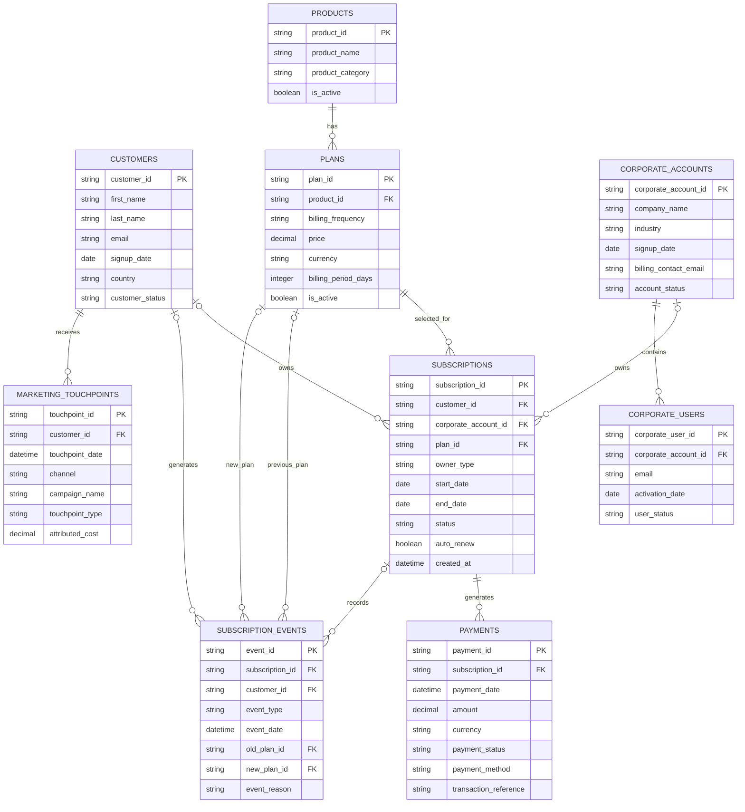

# DAILYPULSE MEDIA

## Subscription Intelligence — Entity Relationship Diagram (ERD)

**Project:** DAILYPULSE Subscription Intelligence

**Version:** 1.0

**Database:** PostgreSQL

**Purpose:** Define the core relational data model required to support subscription, revenue, customer lifecycle, corporate account and acquisition analysis.

---

## 1. Overview

The DAILYPULSE Subscription Intelligence database is designed around the customer subscription lifecycle.

The model separates customers, products, plans, subscriptions, payments and lifecycle events so that historical customer behaviour can be preserved rather than overwritten.

It also supports both:

* Individual subscriptions
* Corporate subscriptions

The initial model contains nine core entities:

1. Customers
2. Products
3. Plans
4. Subscriptions
5. Subscription Events
6. Payments
7. Corporate Accounts
8. Corporate Users
9. Marketing Touchpoints

---

## 2. Entity Relationship Diagram



---

## 3. Entity Definitions

### Customers

The `CUSTOMERS` table contains individual registered users of DAILYPULSE MEDIA.

Each customer receives a unique `customer_id`.

A customer may have multiple subscriptions over time, allowing historical subscription behaviour to be preserved.

Examples include customers who:

* Begin with a Daily plan and later move to Monthly
* Upgrade from Digital Basic to Digital Premium
* Churn and later reactivate
* Hold multiple subscriptions at different points in time

---

### Products

The `PRODUCTS` table contains the core DAILYPULSE MEDIA subscription products.

Examples include:

* Digital Basic
* Digital Premium
* Daily ePaper
* Weekend ePaper
* Student Digital
* Corporate ePaper

A product describes **what the customer is purchasing**.

It does not define how frequently the customer is billed.

---

### Plans

The `PLANS` table contains the individual purchasable versions of each product.

For example:

**Digital Premium** is a product.

The following are separate plans:

* Digital Premium Weekly
* Digital Premium Monthly
* Digital Premium Annual

Each plan therefore combines:

* Product
* Billing frequency
* Price
* Billing period

A single product may have multiple plans.

---

### Subscriptions

The `SUBSCRIPTIONS` table records actual subscriptions purchased by customers or corporate accounts.

Each subscription references one plan.

A subscription may belong to either:

1. An individual customer, or
2. A corporate account

The `owner_type` field identifies the type of subscriber.

For an individual subscription:

```text
owner_type = individual
customer_id = CUST001
corporate_account_id = NULL
```

For a corporate subscription:

```text
owner_type = corporate
customer_id = NULL
corporate_account_id = CORP001
```

Only one subscription owner should exist for each subscription record.

In the PostgreSQL implementation, a validation rule should ensure that a subscription cannot simultaneously belong to both an individual customer and a corporate account.

---

### Subscription Events

The `SUBSCRIPTION_EVENTS` table preserves important changes that occur throughout the subscriber lifecycle.

Possible event types include:

* trial_started
* trial_converted
* subscription_started
* renewed
* upgraded
* downgraded
* billing_cycle_changed
* cancelled
* expired
* churned
* reactivated

This table makes it possible to reconstruct customer journeys over time.

For example:

```text
Free Trial
    ↓
Digital Basic Monthly
    ↓
Renewal
    ↓
Digital Premium Monthly
    ↓
Renewal
    ↓
Cancellation
```

The `old_plan_id` and `new_plan_id` fields allow migration events to record where a customer moved from and where they moved to.

For example:

```text
event_type = upgraded
old_plan_id = Digital Basic Monthly
new_plan_id = Digital Premium Monthly
```

Some early lifecycle events, such as `trial_started`, may occur before a paid subscription exists.

For this reason, `subscription_id` may be empty for certain pre-subscription events while the event remains linked to the customer through `customer_id`.

---

### Payments

The `PAYMENTS` table records payment attempts associated with subscriptions.

It includes both:

* Successful payments
* Failed payments

Capturing failed payments is important because they may eventually contribute to involuntary churn.

The payments table will support analysis including:

* Subscription revenue
* Failed payment rates
* Revenue by product
* Revenue by billing frequency
* ARPU
* Recurring revenue
* Involuntary churn

One subscription may generate multiple payment records over time.

---

### Corporate Accounts

The `CORPORATE_ACCOUNTS` table represents organisations purchasing DAILYPULSE MEDIA corporate subscriptions.

Examples might include:

* Banks
* Universities
* Government agencies
* Professional firms
* Large companies

A corporate account may purchase either:

* Monthly Corporate ePaper
* Annual Corporate ePaper

Corporate accounts are separate from individual customer records.

---

### Corporate Users

The `CORPORATE_USERS` table contains employees or authorised users receiving access through a corporate account.

Each corporate user represents an activated corporate seat.

For example:

```text
Corporate Account: Horizon Bank

Seats Purchased: 50
Corporate Users Activated: 43
```

This would produce:

```text
Seat Utilisation = 43 / 50 = 86%
```

The number of seats purchased will be stored at the corporate subscription level when the detailed data dictionary is developed.

The `CORPORATE_USERS` table records the users who have actually activated those seats.

---

### Marketing Touchpoints

The `MARKETING_TOUCHPOINTS` table captures customer interactions with acquisition and marketing channels.

Examples include:

* Organic Search
* Email
* Paid Search
* Paid Social
* Social Media
* Referral
* Affiliate / Partner
* Promotional Campaign
* Campus Activation

A customer may have multiple marketing touchpoints before or after becoming a subscriber.

This enables analysis beyond basic acquisition counts.

For example, the business may determine that:

> Paid Social generates more subscribers, but Organic Search customers demonstrate stronger retention and higher lifetime value.

The `attributed_cost` field provides a working basis for customer acquisition cost analysis within the synthetic dataset.

---

## 4. Core Relationships

### Products → Plans

**One product can have many plans.**

Example:

```text
Digital Basic
    ├── Daily
    ├── Weekly
    ├── Monthly
    └── Annual
```

---

### Plans → Subscriptions

**One plan can be selected by many subscriptions.**

For example, thousands of customers may subscribe to Digital Premium Monthly.

---

### Customers → Subscriptions

**One individual customer can have zero or many subscriptions over time.**

A subscription may have no `customer_id` when it belongs to a corporate account.

---

### Corporate Accounts → Subscriptions

**One corporate account can have zero or many subscriptions over time.**

A corporate subscription will not have an individual `customer_id`.

---

### Subscriptions → Payments

**One subscription can generate many payment records.**

Example:

```text
Monthly Subscription
    ├── January Payment
    ├── February Payment
    ├── March Payment
    └── April Payment
```

---

### Subscriptions → Subscription Events

**One subscription can generate many lifecycle events.**

Examples include:

```text
Started
Renewed
Upgraded
Downgraded
Cancelled
Churned
```

---

### Customers → Marketing Touchpoints

**One customer can have many marketing touchpoints.**

This allows DAILYPULSE MEDIA to reconstruct customer acquisition journeys and evaluate marketing effectiveness.

---

### Corporate Accounts → Corporate Users

**One corporate account can contain many corporate users.**

Corporate users consume the seats purchased under a corporate subscription.

---

## 5. Key Modelling Decisions

### Preserve History

Subscription changes should never overwrite historical information.

If a customer changes from:

```text
Digital Basic Monthly
```

to:

```text
Digital Premium Monthly
```

the database should retain evidence of both states and record the migration as an event.

---

### Separate Products from Plans

Products and plans serve different purposes.

```text
PRODUCT
Digital Premium

PLANS
Digital Premium Weekly
Digital Premium Monthly
Digital Premium Annual
```

This structure avoids repeating product information unnecessarily and makes pricing and billing analysis easier.

---

### Separate Subscriptions from Payments

A subscription represents the commercial relationship.

A payment represents a financial transaction.

One subscription may therefore have many payments.

Keeping the two separate allows failed payments, successful renewals and revenue history to be analysed independently.

---

### Support Both Individual and Corporate Customers

The same subscription structure will support both subscriber types.

Each subscription belongs to either:

```text
Individual Customer
```

or:

```text
Corporate Account
```

but never both simultaneously.

---

### Track Events Instead of Overwriting Status History

The current subscription status may tell us:

```text
status = cancelled
```

but this alone does not explain the customer's journey.

The event table allows us to understand:

```text
Trial
→ Subscription
→ Renewal
→ Upgrade
→ Renewal
→ Failed Payment
→ Cancellation
```

This event history will later support migration analysis, churn modelling and customer lifecycle analysis.

---

## 6. Future Extensions

The first version of the database intentionally focuses on the core subscription business.

Additional entities may be introduced later as analytical requirements become more advanced.

Potential future tables include:

### Customer Engagement

Possible behavioural data such as:

* Articles viewed
* Sessions
* Login frequency
* Reading time
* Content categories
* Days since last activity

This data could later improve churn prediction and customer segmentation.

### Support Interactions

Possible customer-service data including:

* Support tickets
* Complaint type
* Resolution time
* Cancellation enquiries
* Billing issues

This could help determine whether customer-service experiences are associated with churn.

These tables are not required for the initial database implementation and will only be added when justified by a specific analytical requirement.

---

## 7. Next Stage

Once the ERD is approved, the next step is to develop the **Data Dictionary**.

The Data Dictionary will define every field in the database, including:

* Column name
* Table
* Description
* Data type
* Allowed values
* Primary keys
* Foreign keys
* Nullable fields
* Business rules
* Example values

The Data Dictionary will then serve as the specification for generating the synthetic DAILYPULSE MEDIA dataset.
