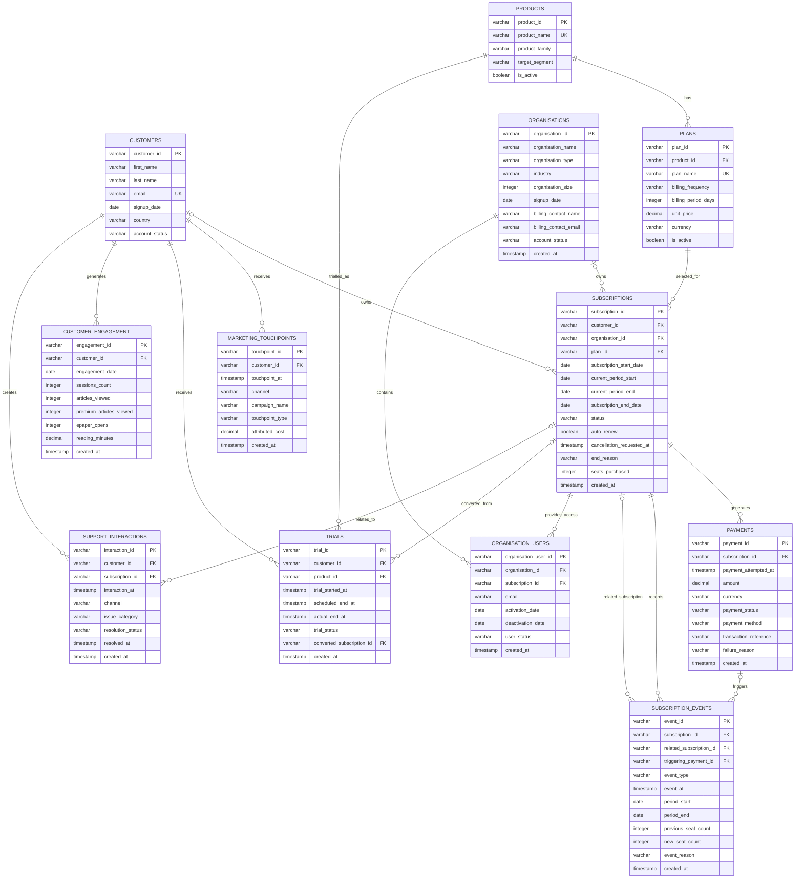

# DAILYPULSE MEDIA

## Subscription Intelligence — Entity Relationship Diagram (ERD)

**Project:** DAILYPULSE Subscription Intelligence

**Version:** 1.0

**Database:** PostgreSQL

---

## 1. Purpose

This document defines the final v1 relational structure for the DAILYPULSE MEDIA Subscription Intelligence database.

The model supports:

* Individual customers
* Organisation subscriptions
* Subscription plans
* Payments
* Subscription lifecycle events
* Free trials
* Marketing acquisition
* Customer engagement
* Customer support activity
* Organisation seat utilisation

The v1 model contains 12 core tables.

---

## 2. Entity Relationship Diagram



---

## 3. Core Data Flow

At a high level, the DAILYPULSE MEDIA data model works like this:

```text
CUSTOMER
   │
   ├── MARKETING TOUCHPOINTS
   │
   ├── FREE TRIAL
   │       │
   │       └── may convert into
   │
   ├── SUBSCRIPTION
   │       │
   │       ├── PAYMENTS
   │       │
   │       ├── SUBSCRIPTION EVENTS
   │       │
   │       └── SUPPORT INTERACTIONS
   │
   └── CUSTOMER ENGAGEMENT
```

For organisations:

```text
ORGANISATION
      │
      ├── SUBSCRIPTION
      │       │
      │       ├── PAYMENTS
      │       └── SUBSCRIPTION EVENTS
      │
      └── ORGANISATION USERS
```

---

## 4. Product and Plan Structure

DAILYPULSE MEDIA separates products from their purchasable billing plans.

### Products

* Digital Basic
* Digital Premium
* ePaper
* Weekend ePaper
* Student Digital
* Corporate ePaper

### Product Families

* Digital News
* ePaper

### Example Relationship

```text
Digital Basic
    ├── Daily
    ├── Weekly
    ├── Monthly
    └── Annual
```

```text
ePaper
    ├── Daily
    ├── Weekly
    ├── Monthly
    └── Annual
```

```text
Weekend ePaper
    ├── Weekly
    └── Monthly
```

```text
Corporate ePaper
    ├── Monthly
    └── Annual
```

Corporate ePaper pricing is calculated on a per-seat basis.

---

## 5. Subscription Ownership

Each subscription belongs to exactly one owner.

It may belong to:

* an individual customer; or
* an organisation.

For an individual subscription:

```text
customer_id = populated
organisation_id = NULL
```

For an organisation subscription:

```text
customer_id = NULL
organisation_id = populated
```

A subscription must never belong to both.

---

## 6. Subscription History

One subscription record represents one continuous period on one specific plan.

A normal renewal does not create a new subscription record.

A plan change does create a new subscription record.

Example:

```text
SUB001
Digital Basic Monthly
Jan 01 → Mar 31

        ↓ plan change

SUB002
Digital Premium Monthly
Apr 01 → Jun 30

        ↓ plan change

SUB003
Digital Premium Annual
Jul 01 → Ongoing
```

Historical subscription records are preserved.

---

## 7. Subscription Events

`SUBSCRIPTION_EVENTS` records meaningful lifecycle changes.

Examples include:

* subscription started
* renewal
* cancellation requested
* cancellation reversed
* plan changed
* past due started
* past due resolved
* subscription ended
* reactivation
* organisation seat change

Payment attempts themselves belong in `PAYMENTS`.

A payment may optionally trigger a subscription event through:

```text
triggering_payment_id
```

Example:

```text
Failed Payment
      ↓
Past Due Started
```

---

## 8. Cancellation and Churn

Cancellation and churn are treated separately.

A cancellation request represents **intent to churn**.

A customer may request cancellation while still retaining access until the end of the current paid billing period.

Churn itself is not stored directly.

It is derived using:

* `subscription_end_date`
* `end_reason`
* subsequent subscription activity

This allows the database to distinguish between:

```text
Plan ended because of upgrade
→ NOT CHURN
```

and:

```text
Plan ended because of voluntary cancellation
→ no replacement subscription
→ VOLUNTARY CHURN
```

---

## 9. Payments

Each row in `PAYMENTS` represents one payment attempt.

A failed payment must never be overwritten as successful.

Example:

```text
PAY001
KES 800
failed

PAY002
KES 800
successful
```

Both payment attempts remain in the database.

Revenue is derived from successful payments only.

For organisation subscriptions, payment amounts represent the total amount charged across all purchased seats.

---

## 10. Organisation Model

The database uses `ORGANISATIONS` rather than corporate accounts because Corporate ePaper may be purchased by:

* Corporates
* Universities
* Government institutions
* NGOs
* Professional associations
* Other institutions

The commercial product remains named:

**Corporate ePaper**

`organisation_size` stores the estimated addressable population.

Organisation band is derived from that value rather than stored.

---

## 11. Organisation Users

`ORGANISATION_USERS` represents activated seats under an organisation subscription.

One active organisation user represents one activated seat.

Seat utilisation can therefore be calculated as:

```text
Active Organisation Users
-------------------------
Seats Purchased
```

Organisation user history is preserved even after access is deactivated.

---

## 12. Free Trials

Free trials are stored separately from paid subscriptions.

Business rules:

* Maximum duration: 7 days
* One free trial per individual customer
* Only Digital News products are eligible
* Eligible products:

  * Digital Basic
  * Digital Premium
  * Student Digital
* ePaper products are not trial eligible
* Organisations are not trial eligible

A trial may end through:

* conversion
* expiry
* cancellation

If converted, it links directly to the resulting paid subscription through:

```text
converted_subscription_id
```

---

## 13. Marketing Touchpoints

Customers may have multiple marketing interactions.

Examples:

* Organic Search
* Paid Search
* Organic Social
* Paid Social
* Email
* Direct
* Referral
* Affiliate / Partner
* Campus Activation
* Promotional Campaign

Marketing touchpoints connect to customers rather than directly to subscriptions.

This preserves the full acquisition journey.

---

## 14. Customer Engagement

`CUSTOMER_ENGAGEMENT` stores daily behavioural activity for individual customers.

Examples include:

* sessions
* articles viewed
* premium articles viewed
* ePaper opens
* reading time

One row represents one customer's recorded engagement on one day.

Metrics such as:

* days since last activity
* 30-day engagement
* engagement decline
* churn risk

are derived later rather than stored.

---

## 15. Support Interactions

`SUPPORT_INTERACTIONS` captures lightweight customer support activity.

Possible categories include:

* billing
* payment
* access/login
* technical
* content
* subscription change
* cancellation enquiry

This allows future churn analysis to test whether support behaviour is associated with customer loss.

---

## 16. Historical Data Principle

The database is designed to preserve historical activity wherever possible.

The following should never be silently overwritten:

* historical subscription plans
* failed payments
* renewal periods
* cancellation requests
* cancellation reversals
* plan changes
* seat increases
* seat decreases
* deactivated organisation users

Current state may change, but historical events and transactions remain available for analysis.

---

## 17. Version Status

**DAILYPULSE MEDIA Data Model v1.0 — FROZEN**

The next project stage is implementation of the PostgreSQL database schema.

The schema will translate this model into:

* tables
* primary keys
* foreign keys
* unique constraints
* check constraints
* nullability rules
* referential integrity
